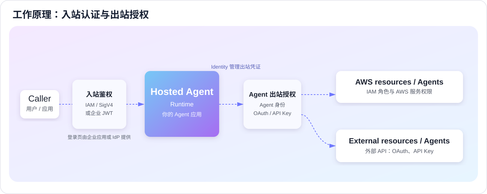

# 第一章：AWS 中国区功能介绍

很多教程先画一张很大的架构图，读者还没开始，就遇到十几个名词。

我们换一种方式。只问一个问题：**一个助手怎样替你查服务器？**

## 一、先把请求走一遍

你发送一句话：“看看服务器的 CPU。”

程序先把问题交给模型。模型决定调用监控工具。工具从 CloudWatch 取回数据。模型读完数据，再组织回答。

```text
提问 → 应用 → 模型选择工具 → 工具查数据 → 应用整理回答
```

这条路径里，模型不是唯一的工作者。程序、工具、权限和数据都必须存在。

## 二、Runtime：让程序有地方运行

在电脑上，你用 `python app.py` 启动程序。关闭电脑，别人就不能继续访问它。

Runtime 提供云端运行环境。你上传程序或容器，通过服务接口向它发请求。它启动运行环境，执行入口函数，返回结果。

Runtime 可以运行使用不同框架和模型的应用。它不会看到一个普通 Python 函数，就自动替你生成模型逻辑。

中国区支持 Runtime，但容量提供方式限于 MicroVM。本教程使用容器部署，不依赖 Global 的 Managed EC2 容量提供方。[中国区差异](https://docs.amazonaws.cn/en_us/aws/latest/userguide/bedrock-agentcore.html)

## 三、Gateway：让工具有统一入口

工具是什么？其实就是能做一件具体事情的函数。

例如：`list_instances` 列出实例，`query_cpu` 查 CPU，`lookup_stop_events` 查关机事件。

这些函数可以放在 Lambda，也可以由已有 API 提供。Gateway 将它们描述成统一的 MCP 工具，供 Agent 发现和调用。

```text
Agent → Gateway → Lambda / API
```

MCP 是工具交互协议。你先列举工具，看到名字、用途和参数；然后按参数调用。Gateway 不负责替你写查询 CPU 的业务代码。

中国区没有 Gateway 语义工具搜索，但正常列举和调用工具不受影响。开始时使用明确的工具清单就可以。

## 四、Identity：先分清入站和出站

“Identity”最容易被混成一件事。实际上先问方向就清楚了：是用户进入 Agent，还是 Agent 去访问别的系统？



| 方向 | 谁访问谁 | 谁负责登录与鉴权 | Identity 在哪里 |
| --- | --- | --- | --- |
| 入站 | 用户或你的应用 → Runtime / Gateway | 企业 IdP 登录后签发 JWT；Runtime/Gateway 校验 JWT。使用 AWS 调用时，由 IAM/SigV4 校验 | 可参与 IdP / JWT 身份集成；不提供登录网页 |
| 出站 | Agent / Gateway → 外部系统 | 外部系统校验它自己的 IAM、OAuth token 或 API Key | 管理 Agent 工作负载身份，以及 OAuth token、API Key 等凭证 |

### 入站：谁可以调用 Runtime 或 Gateway

用户先在企业已有的 IdP 登录。IdP 的登录页、MFA 和会话管理仍由企业应用或 IdP 负责。前端取得 JWT 后，带着它调用 AgentCore；Runtime 或 Gateway 按你配置的 issuer、audience、client、scope 或 claims 进行校验。

另一条入站路径是 AWS IAM：调用应用使用 IAM 用户、角色或 EC2/Lambda/ECS 的临时凭证，SDK 以 SigV4 签名请求。此时不需要用户 JWT，也不需要 API Key Provider。

| 入口 | 适合什么 | 调用方带什么 |
| --- | --- | --- |
| Runtime + IAM | 服务到服务、内部运维脚本、AWS 工作负载 | SigV4 签名请求 |
| Runtime + JWT | Web / 移动端经企业登录后的用户调用 | `Authorization: Bearer <JWT>` |
| Gateway + AWS_IAM | 本教程的 Agent 调工具 | SigV4 签名请求 |
| Gateway + CUSTOM_JWT | 希望按企业登录用户限制工具调用 | 符合 Gateway 配置的 JWT |

中国区 Gateway 只有 `AWS_IAM` 和 `CUSTOM_JWT` 两种入站方式，没有无鉴权入口；使用 `CUSTOM_JWT` 时，企业 OIDC IdP 是实际签发 JWT 的一方。中国区不支持 Cognito user pool 的快捷配置。[中国区差异](https://docs.amazonaws.cn/en_us/aws/latest/userguide/bedrock-agentcore.html)、[Runtime 入站鉴权](https://docs.amazonaws.cn/en_us/bedrock-agentcore/latest/devguide/runtime-oauth.html)

### 出站：Agent 怎样访问外部系统

假设 Agent 要读取企业工单。工单 API 要求 API Key，或需要 OAuth token。Identity 可以保存和按需取用这类凭证，Gateway 带着凭证向工单 API 发请求。工单系统最终决定这个凭证能读取哪些工单。

已有企业 SSO 不必替换：它继续负责用户登录；Identity 解决的是 Agent 运行时怎样安全持有和使用外部系统凭证。若现有凭证管理已经满足要求，也不必为了使用 AgentCore 再复制一份。

**Identity 的 API Key Provider 不是入站 API Key。** 它不让客户拿 Key 直接调用 Runtime 或 Gateway；它是 Agent 出站调用外部服务时使用的 Key 存放与引用配置。完整 API Key 例子在第四章的 [外部工单服务](../04-agents/identity.md)。[Identity 概览](https://docs.amazonaws.cn/en_us/bedrock-agentcore/latest/devguide/identity.html)

## 五、另外三个组件

**Observability** 帮你看执行过程。你需要知道请求耗时、工具返回了什么错误、模型调用在哪一步。它与 CloudWatch 等观测能力配合，应用仍须按需要记录和配置追踪。

**Browser** 提供托管浏览器会话。只有必须点击网页、填写表单等任务才需要它。已有稳定 API 时，可以直接调用 API。

**Code Interpreter** 提供隔离执行环境。比如把查询得到的数据交给 Python，计算平均值，再生成图表。它与负责运行整个应用的 Runtime 分工不同。

## 六、Global 与中国区的差异

AWS 中国区已经提供 Runtime、Gateway、Identity、Observability、Browser 和 Code Interpreter，可以完成本教程中的 Agent 运行、工具调用、身份管理、代码执行、浏览器操作和监控链路。

与 Global 相比，部分 AgentCore 能力和配置选项尚未提供。开发时按下面方式处理即可：

| Global 能力或配置 | 中国区 | 本教程的处理方式 |
| --- | --- | --- |
| Memory | 未提供 | 按应用需要使用 DynamoDB、S3、Redis/Valkey 或数据库管理会话与长期记忆 |
| Harness | 未提供托管能力 | 在应用中实现任务编排、超时、失败处理和状态管理，第五章给出示例 |
| Registry | 未提供 | 使用应用配置或数据库维护 Agent/工具能力清单 |
| Policy | 未提供 | 使用 IAM、Gateway 鉴权、工具权限和应用校验控制访问 |
| Knowledge Bases | 未提供 | 接入中国区可用的检索或向量存储方案 |
| Evaluations / Optimizations | 未提供 | 使用自己的测试集、质量指标和评测流程 |
| Runtime Managed EC2 | 未提供 | 使用 AgentCore Runtime 的 MicroVM 运行方式 |
| S3 Files 挂载 | 未提供 | 应用通过 S3 API 读写对象，需要处理时使用本地临时目录 |
| Cognito 快捷入站配置 | 未提供 | 使用 IAM，或企业 OIDC IdP + CUSTOM_JWT |
| Gateway 语义工具搜索 | 未提供 | 使用 tools/list，必要时在应用中维护工具路由 |
| Gateway inference target | 未提供 | Agent 应用直接配置并调用模型，例如本教程的 DeepSeek |
| Gateway 无鉴权入站 | 未提供 | 使用 AWS_IAM 或 CUSTOM_JWT |

这些差异主要影响组件选择和实现方式，不改变 Agent 的核心工作模式：**模型负责理解与决策，Runtime 托管 Agent，Gateway 提供工具，Identity 管理身份和外部凭证，Observability 负责运行观测。** 对本教程覆盖的 Agent 功能和使用价值没有本质影响。

功能会持续更新，完整支持范围以 [AWS 中国区 AgentCore 功能差异](https://docs.amazonaws.cn/en_us/aws/latest/userguide/bedrock-agentcore.html) 为准。

下一章：[Vibe coding MCP 使用](../02-mcp/README.md)。
