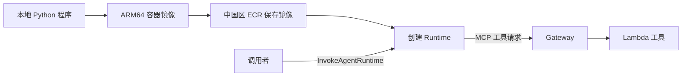

# 第三章：服务构建指南

这一章从一个普通 Python 程序开始。

我们先让它返回一句话，再把它放到 Runtime，最后接上一个 Gateway 工具。读完后，你应能解释每一步，而不是只会运行一条“部署全部”的命令。



## 一、先分清三个东西

**代码**决定接到请求后做什么。**镜像**把代码和依赖打包。**Runtime**把镜像运行起来，并提供外部调用接口。

ECR 只是镜像仓库。把镜像上传 ECR，不代表应用已经运行。Runtime 创建成功，也不代表请求一定成功；还要实际调用入口验证。

## 二、采用什么部署方式

本教程直接使用 **botocore**，也就是 AWS Python SDK 的底层客户端库。

你会看到这样的代码：

```python
import botocore.session
session = botocore.session.get_session()
control = session.create_client("bedrock-agentcore-control", region_name="cn-northwest-1")
```

它负责选择服务地址、读取 AWS 凭证、签名请求、调用 API、解析结果。boto3 是构建在它之上的常用高层 SDK；本教程不用 AgentCore CLI 隐藏这些步骤。

“控制面”客户端名是 `bedrock-agentcore-control`，用于创建资源；“数据面”客户端名是 `bedrock-agentcore`，用于调用运行中的应用。理解这个区别，有助于排查权限错误。[botocore 文档](https://docs.aws.amazon.com/botocore/latest/reference/services/bedrock-agentcore-control.html)

## 三、准备环境

以下命令使用 Linux 的 Bash，从仓库根目录执行。可以在本机 Linux、WSL 或自己的 EC2 上操作。

需要 Python 3.12、Docker、AWS CLI、jq、ARM64 构建能力，以及已经配置的 AWS 中国区身份。jq 用来读取部署记录中的字段。

首次取得教程并建立 Python 虚拟环境：

```bash
git clone https://github.com/zjinsong/Learning-Agentcore.git
cd Learning-Agentcore
python3 -m venv .venv
source .venv/bin/activate
```

已有仓库时进入它的根目录即可。Ubuntu 缺少虚拟环境或 jq 时，可以先安装 `python3-venv`、`jq` 系统包。后文的 `python` 指已激活虚拟环境中的 Python。

```bash
python --version
docker version
aws --version
jq --version
python -m pip install -U botocore bedrock-agentcore requests
```

设置本地 profile 别名和区域：

```bash
export AWS_PROFILE=china-learning
export AWS_REGION=cn-northwest-1
export AWS_DEFAULT_REGION=cn-northwest-1
aws sts get-caller-identity --region cn-northwest-1
```

`china-learning` 是你的本地配置名，不是仓库提供的账号。尚未配置时，先完成企业已有的登录流程，或按 [CLI 凭证配置](https://docs.amazonaws.cn/en_us/cli/latest/userguide/cli-chap-configure.html) 建立自己的身份。上面的输出含账户信息，只在本地查看。

若在 EC2 上使用实例角色，跳过 `export AWS_PROFILE=china-learning`，保持区域设置即可。不要把不存在的 profile 覆盖到已经可用的实例角色身份上。

北京区域使用 `cn-north-1`；整个实验保持一致。创建资源需要部署身份具备对应服务权限，运行程序则使用下面的执行角色。

## 四、为什么需要多个角色

| 身份 | 做什么 | 需要哪些权限 |
| --- | --- | --- |
| 部署者 | 创建资源、上传镜像、传递角色 | 管理本实验 ECR/IAM/Runtime/Gateway/Lambda、日志，以及 PassRole |
| Runtime 角色 | 启动程序，调用工具 | 拉取学习镜像、写自己的日志、调用指定 Gateway |
| Gateway 角色 | 调用注册的工具 | InvokeFunction 到指定 Lambda |
| Lambda 角色 | 运行查询代码 | 写日志；业务例子再增加只读查询动作 |

可以把部署者理解为安装人员，执行角色理解为程序运行时的工作证。安装人员有权限，不代表程序运行后也有这些权限。

AWS 凭证不能写进容器。程序通过执行角色获得必要的访问权限。部署者需要 `iam:PassRole`，表示允许把相应角色交给服务使用。[Runtime 权限](https://docs.amazonaws.cn/en_us/bedrock-agentcore/latest/devguide/runtime-permissions.html)、[Gateway 权限](https://docs.amazonaws.cn/en_us/bedrock-agentcore/latest/devguide/gateway-prerequisites-permissions.html)

## 五、按顺序操作

1. [构建 Runtime](runtime.md)：入口代码、本地运行、镜像、角色、创建与状态。
2. [怎样调用 Agent](invoke.md)：服务契约、外部调用接口、认证、endpoint、session、流式返回。
3. [构建 Gateway](gateway.md)：把 Lambda 注册成工具，并从 Runtime 调用。
4. [实验结束后清理](cleanup.md)：按依赖顺序删除学习资源。

完整代码集中在各节末尾。示例资源名都有 `tutorial` 标记，真实标识保存在被 Git 忽略的 `.local/`，不依赖任何已有 CloudOps 环境。
