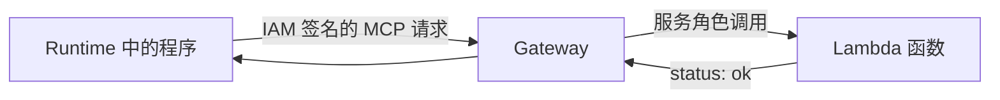

# 3.3 给 Runtime 接一个工具

前两节的程序只返回一句话。现在让它做一点额外的工作：调用一个工具，确认 Gateway 到 Lambda 的链路可通。

我们暂时不接业务数据，工具叫 `get_learning_status`，只返回 `status: ok`。

## 一、Gateway 与 Lambda 分别做什么

Lambda 保存业务函数。Gateway 负责把它变成 Agent 可以发现和调用的 MCP 工具。



你不需要在 Lambda 里启动一个常驻 MCP Server。Gateway 根据工具描述转换请求，然后调用 Lambda。

## 二、写一个没有业务权限的函数

```python
def handler(event, context):
    return {"status": "ok", "message": "Gateway-to-Lambda learning target is reachable"}
```

配置 Python 3.12，入口 `handler.handler`，超时 30 秒。函数角色只写自己的日志，不需要 EC2 权限。

Lambda 接收的是 ZIP 包，和 Runtime 的容器镜像不同。先把入口文件压成包：

```python
archive = io.BytesIO()
with zipfile.ZipFile(archive, "w", zipfile.ZIP_DEFLATED) as package:
    package.write("examples/gateway/handler.py", "handler.py")
```

创建信任 `lambda.amazonaws.com` 的 Lambda 角色，给它写指定日志组的权限。提前创建 `/aws/lambda/agentcore-tutorial-status` 日志组，然后创建函数：

```python
function = lam.create_function(
    FunctionName="agentcore-tutorial-status",
    Runtime="python3.12", Role=lambda_role_arn,
    Handler="handler.handler", Code={"ZipFile": archive.getvalue()},
    Timeout=30, MemorySize=128,
)
lambda_arn = function["FunctionArn"]
lam.get_waiter("function_active_v2").wait(FunctionName="agentcore-tutorial-status")
```

`lam` 是 botocore 的 `lambda` 客户端。等待函数可用，再把它交给 Gateway；IAM 角色刚创建时也可能需要等待传播。

## 三、描述这个工具

工具描述也叫 schema。Agent 通过它知道工具名字、用途和参数。

```json
{
  "name": "get_learning_status",
  "description": "Check Gateway to Lambda connectivity",
  "inputSchema": {"type": "object", "properties": {}, "required": []}
}
```

本例无参数，所以 properties 是空对象。有参数的工具必须在函数内再次验证；schema 不是业务授权的替代。

## 四、给 Gateway 一个工作证

Gateway service role 信任 AgentCore，允许调用这个 Lambda：

```python
permission = {
    "Effect": "Allow",
    "Action": "lambda:InvokeFunction",
    "Resource": lambda_arn
}
```

Lambda execution role 和 Gateway service role 不能混淆。前者决定函数能访问哪些数据，后者决定 Gateway 能调用哪个函数。

同账户 Lambda 可以通过 Gateway role 身份策略授权。跨账户还需要目标资源策略；本教程不扩展到跨账户。[Gateway 权限](https://docs.amazonaws.cn/en_us/bedrock-agentcore/latest/devguide/gateway-prerequisites-permissions.html)

## 五、创建 Gateway，再注册 target

创建参数如下：

```python
gateway = control.create_gateway(
    name="tutorial-gateway",
    roleArn=gateway_role_arn,
    protocolType="MCP",
    authorizerType="AWS_IAM",
)
```

中国区 Gateway 必须使用 AWS_IAM 或 CUSTOM_JWT。本例用 AWS_IAM，即调用方用 AWS 凭证签名。PUBLIC 网络或公开 URL 不代表免鉴权。

`target` 是 Gateway 要连接的一个目标。注册 Lambda 和 schema：

```python
target = control.create_gateway_target(
    gatewayIdentifier=gateway["gatewayId"],
    name="tutorial-status",
    targetConfiguration={"mcp": {"lambda": {
        "lambdaArn": lambda_arn,
        "toolSchema": {"inlinePayload": [tool_schema]}
    }}},
    credentialProviderConfigurations=[{"credentialProviderType": "GATEWAY_IAM_ROLE"}],
)
```

`AWS_IAM` 管入站，`GATEWAY_IAM_ROLE` 管出站。前者验证谁在调用 Gateway，后者指 Gateway 用自己的角色调用 Lambda。[target 配置](https://docs.amazonaws.cn/en_us/bedrock-agentcore/latest/devguide/gateway-add-target-api-target-config.html)

运行本节辅助程序：

```bash
python examples/gateway/deploy.py
```

它按顺序建立 Lambda、角色、Gateway、target，等待 READY，保存 `.local/gateway.json`。发生错误时核对已经创建的部分，不重新覆盖同名资源。创建后再把 Gateway role 的信任条件收紧到这个 Gateway。

## 六、让 Runtime 有权访问 Gateway

为 Runtime 角色追加一个限定目标的权限：

```python
permission = {
    "Effect": "Allow",
    "Action": "bedrock-agentcore:InvokeGateway",
    "Resource": gateway_arn
}
```

将服务返回的 `gatewayUrl` 放入 Runtime 的环境变量 `GATEWAY_URL`，区域放入 `TOOL_REGION`。地址取服务返回值，不手工猜测域名。

```bash
python examples/runtime/deploy.py connect
```

该步骤更新 Runtime，等待 READY。测试更新后的程序时使用新 session。

## 七、MCP 调用按什么顺序发生

客户端先 initialize，交换协议信息。再列出工具，最后调用具体工具：

```text
initialize → notifications/initialized → tools/list → tools/call
```

工具列举可能分页，工具名也可能带 target 前缀。客户端应使用实际返回的名字，而不是只发送原始函数名。

本例通常看到 `tutorial-status___get_learning_status`，JSON-RPC 调用结构如下：

```json
{
  "jsonrpc":"2.0",
  "id":3,
  "method":"tools/call",
  "params":{"name":"tutorial-status___get_learning_status","arguments":{}}
}
```

IAM 请求还需要 SigV4 签名。参考客户端用 botocore 签完整的 HTTP 请求体，再发给 Gateway；临时凭证的 session token 也由签名过程带上。

## 八、从 Runtime 完成一次真实调用

```bash
python examples/runtime/deploy.py invoke --prompt "check gateway"
```

预期外层应用返回成功，`tool_result` 里包含 Lambda 的 `status: ok`。单看 Gateway READY，不足以证明工具权限和调用链都正确。

| 问题 | 检查哪里 |
| --- | --- |
| 应用说未配置 Gateway | connect、新版本、新 session |
| Gateway 403 | Runtime 角色、SigV4、区域和凭证 |
| 工具不在列表里 | target 状态、schema、分页 |
| Lambda 调用失败 | Gateway 角色 InvokeFunction、函数日志 |
| MCP 返回 isError | 工具失败，应当报错而不是当作业务数据 |

## 最后附上代码

[Lambda 函数](../examples/gateway/handler.py)、[创建 Gateway 与 target](../examples/gateway/deploy.py)、[MCP 签名客户端](../examples/runtime/gateway_client.py)、[Runtime 更新与调用](../examples/runtime/deploy.py)。

接下来可以 [清理学习资源](cleanup.md)，或继续 [第四章](../04-agents/README.md)。
