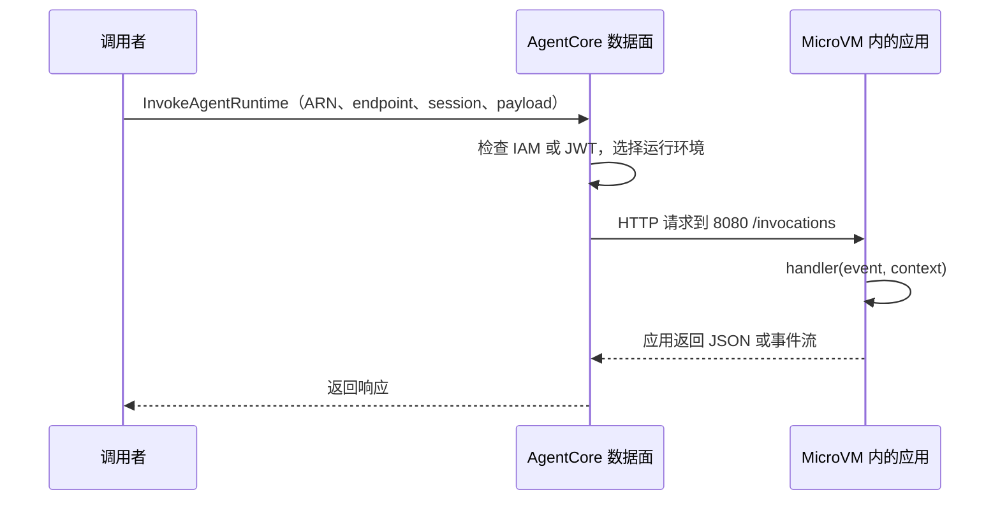
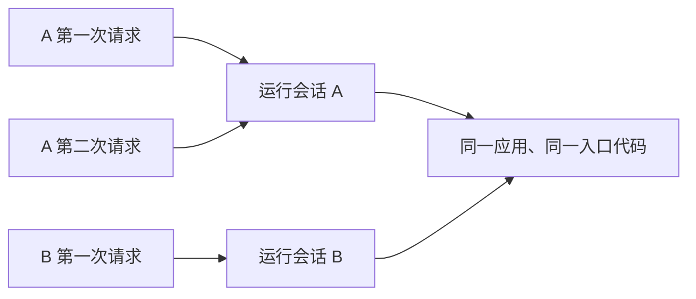

# 3.2 怎样调用 Runtime

很多人到这一步会问：既然程序在 8080 端口运行，我直接请求云上的 8080 不就行了吗？

不是。**容器内的入口和云端对外接口，是两层接口。**

## 一、服务契约是什么

可以把“契约”理解为接口约定。AgentCore 知道往哪个端口、哪个路径发请求，你的程序就必须在那个位置接收，并按规定返回。

Runtime 的服务契约区分四种协议：[官方服务契约](https://docs.amazonaws.cn/en_us/bedrock-agentcore/latest/devguide/runtime-service-contract.html)。

| 协议 | 容器端口与入口 | 适合什么 |
| --- | --- | --- |
| HTTP | 8080，/invocations；可有 /ws | 普通请求/回答，JSON 或流式输出 |
| MCP | 8000，/mcp | 运行提供工具的 MCP Server |
| A2A | 9000，根路径；Agent Card 发现 | 按 A2A 标准与 Agent 交互 |
| AG-UI | 8080，/invocations 或 /ws | 面向界面的事件流交互 |

本教程选择 **HTTP**。多个 Agent 用 HTTP 相互调用也可以，数量变多不意味着必须换成 A2A；要支持现成 MCP 客户端时，才考虑把 Runtime 应用部署成 MCP Server。

## 二、本地直接调用容器入口

在本地，程序在你的电脑上运行，所以这样测试：

```text
POST http://127.0.0.1:8080/invocations
Content-Type: application/json

{"prompt":"hello"}
```

SDK 应用收到请求后调用入口函数。`prompt` 是我们自己定义的字段，Runtime 不要求所有应用都叫这个名字。

## 三、云端先调用 AWS 接口

部署后，调用者先访问 AgentCore 数据面。服务鉴权、选择 endpoint/版本、定位 session，再把请求送进运行环境。



你不是 SSH 到某台 AgentCore 机器，也不是把 MicroVM 的 8080 暴露给浏览器。应用本地路径的约定，不是对外公开地址。

## 四、IAM 调用：botocore 自动签名

下面直接调用上一节部署的第一个 Runtime `tutorial_hello`。程序已经在 AWS 中国区运行；你可以从本机，也可以从具有相应权限的 EC2 上向它发请求。

### 1. 最快的方法：调用已部署的 Runtime

在仓库根目录打开 Linux 终端，使用上一节部署时的 AWS 身份：

```bash
export AWS_PROFILE=china-learning
export AWS_REGION=cn-northwest-1
python examples/runtime/deploy.py status
python examples/runtime/deploy.py invoke --prompt hello
```

第一条 Python 命令检查云端 Runtime 状态，应为 READY。第二条向云端发送 `{"prompt":"hello"}`，不是启动本地程序，也不会重新部署。

预期返回：

```json
{"answer":"Received: hello","mode":"learning-example"}
```

调用脚本从 `.local/runtime.json` 读取上一节保存的 `runtime_arn` 和 `region`，无需手工填写账户或地址。`china-learning` 要替换为你自己的 profile；如果使用 EC2 实例角色，则不用设置这个 profile。

### 2. 自己写一个完整的调用文件

上一种方法已经能用。下面把同一过程展开，便于你在自己的应用中调用它。

在仓库根目录创建 `invoke_first.py`，复制下面完整代码。与仅展示 API 片段不同，这里会先读取真实部署记录，再发请求：

```python
import json
import uuid
from pathlib import Path
import botocore.session
from botocore.config import Config

lab = json.loads(Path(".local/runtime.json").read_text(encoding="utf-8"))
runtime_arn = lab["runtime_arn"]
region = lab["region"]

session = botocore.session.get_session()
client = session.create_client(
    "bedrock-agentcore",
    region_name=region,
    config=Config(connect_timeout=5, read_timeout=90, retries={"total_max_attempts": 1}),
)
response = client.invoke_agent_runtime(
    agentRuntimeArn=runtime_arn,
    qualifier="DEFAULT",
    runtimeSessionId=str(uuid.uuid4()),
    contentType="application/json",
    accept="application/json",
    payload=json.dumps({"prompt": "hello"}).encode("utf-8"),
)
body = response["response"]
try:
    print(body.read().decode("utf-8"))
finally:
    body.close()
    client.close()
```

保存后，仍在仓库根目录执行：

```bash
python -m pip install -U botocore
python invoke_first.py
```

应该得到同一个 `Received: hello`。要换问题，修改 payload 中的 `hello`。目前这个入门程序只回显输入，接入模型后才会生成模型回答。

### 3. 从 AWS 上的 EC2 调用

云端调用不要求调用程序也部署在 Runtime。你可以在 EC2 上运行同一个 Python 文件。

把 `invoke_first.py` 和自己的 `.local/runtime.json` 放在同一工作目录结构中，给 EC2 绑定有目标 Runtime 调用权限的实例角色。在 Linux 终端执行：

```bash
unset AWS_PROFILE
export AWS_REGION=cn-northwest-1
export AWS_DEFAULT_REGION=cn-northwest-1
python3 -m venv .venv
source .venv/bin/activate
python -m pip install -U botocore
python invoke_first.py
```

`unset AWS_PROFILE` 很重要：不要让前面为本机准备的 profile 覆盖 EC2 的实例角色。botocore 会通过默认凭证链获取实例角色的临时凭证。不要把本机的长期 Access Key 写进代码。部署记录含资源标识，留在自己的环境，不提交到公开仓库。

### 4. 调用权限与常见错误

这是底层 SDK 调用，不是把 API Key 塞进请求头。botocore 从你当前 AWS 身份取凭证，完成 SigV4 签名。

调用者需要 `bedrock-agentcore:InvokeAgentRuntime`，策略覆盖目标 Runtime 及被调用的 endpoint；SCP、权限边界或资源策略也可能限制调用。执行角色控制程序对外能做什么，调用者策略控制谁能进来，两者分开。

例如为你自己的调用角色配置下面的权限文档。`runtime_arn` 使用创建返回值；这份策略交给调用者的身份管理员配置，不加到 Runtime 自己的执行角色上：

```python
caller_policy = {
    "Version": "2012-10-17",
    "Statement": [{
        "Effect": "Allow", "Action": "bedrock-agentcore:InvokeAgentRuntime",
        "Resource": [runtime_arn, runtime_arn + "/runtime-endpoint/DEFAULT"],
    }],
}
```

只列出本例 DEFAULT endpoint，避免授予调用所有应用的权限。[资源与动作参考](https://docs.aws.amazon.com/service-authorization/latest/reference/list_bedrock-agentcore.html)

本例 `read_timeout=90` 是客户端读取等待期限，不是模型任务总期限，也不是 Runtime 固定上限。[Invoke API](https://docs.aws.amazon.com/botocore/latest/reference/services/bedrock-agentcore/client/invoke_agent_runtime.html)

| 现象 | 怎么检查 |
| --- | --- |
| 找不到 .local/runtime.json | 回到仓库根目录；确认上一节创建步骤已完成 |
| 文件中没有 runtime_arn | 目前可能只完成 prepare，尚未成功创建 Runtime |
| 找不到 AWS 凭证 | 检查本机 profile 登录，或 EC2 实例角色 |
| AccessDenied / 403 | 检查调用者对 Runtime 和 DEFAULT endpoint 的权限 |
| ResourceNotFound | 检查记录的 ARN、区域，确认资源未删除 |
| 超时或应用异常 | 检查云端 Runtime 日志；先调用最小 hello 排除模型和工具因素 |

## 五、四个参数分别是什么

| 参数 | 理解方式 | 本例 |
| --- | --- | --- |
| agentRuntimeArn | 找到要调用哪个应用 | 创建服务时返回的完整 ARN |
| qualifier | 选择应用的 endpoint | DEFAULT |
| runtimeSessionId | 标识一次运行会话 | UUID 字符串 |
| payload | 给程序的业务输入 | JSON 编码后的字节 |

**endpoint 与版本不同。** Runtime 更新会产生新版本，endpoint 是指向版本的调用入口。DEFAULT 是默认 endpoint，更新后自动指向新版本；自定义 endpoint 可以指向指定版本。实际调用前仍可核对入口状态与版本。[Runtime 工作方式](https://docs.amazonaws.cn/en_us/bedrock-agentcore/latest/devguide/runtime-how-it-works.html)

**session 不是聊天记录数据库。** 相同 session ID 可让后续请求复用运行环境，直到会话结束或回收；它不保证程序永久保存聊天。要长期保存历史，需要应用自己存储。

session ID 至少 33 个字符，普通 UUID 字符串有 36 个字符。给不同用户、不同任务分配不同会话；验证刚更新的应用时用新 session，避免旧会话继续使用原环境。

## 六、JWT 调用有什么不同

若 Runtime 配置了 JWT authorizer，调用者先向信任的企业 IdP 获取符合条件的 token，再携带 `Authorization: Bearer ...` 请求 Runtime。

服务校验签名、有效期及你配置的 audience/client/scope/claims。企业 IdP 负责登录与签发令牌，Runtime 负责校验调用凭证。

这属于**入站**认证：用户或调用应用进入 Runtime。它和 Gateway 使用 Identity 取得工单 OAuth token/API Key 的**出站**授权是两条不同方向的链路。第一章有完整的方向图和选择表：[Identity：入站与出站](../01-china/README.md#四identity先分清入站和出站)。

中国区不要直接复制 Cognito user pool 快速创建示例。IAM 与 JWT 是不同入站配置，不是给同一请求同时放两种凭证即可。[Runtime 入站说明](https://docs.amazonaws.cn/en_us/bedrock-agentcore/latest/devguide/runtime-oauth.html)

JWT 的请求仍进入 AgentCore 对外接口，然后才转到容器内部入口。HTTP 地址结构示意为：

```text
https://bedrock-agentcore.<区域>.amazonaws.com.cn/runtimes/<URL编码后的RuntimeARN>/invocations?qualifier=DEFAULT
```

使用时按服务文档/SDK 的当前端点构造，编码 ARN，设置本次会话头 `X-Amzn-Bedrock-AgentCore-Runtime-Session-Id`。IAM 入站请求不能只用普通 curl 不签名；本教程优先使用 botocore 避免自己拼签名。

## 七、JSON、流式输出、WebSocket

短请求可以一次返回 JSON。长回答可返回 SSE 事件流，让客户端逐段接收。WebSocket 用于双向实时交互，遵循单独握手与认证规则；不能把 `/ws` 当成一次普通 POST。

本页的 `.read()` 用于读取整个简单响应。若应用返回 SSE，应按事件解析；想边接收边显示，可读取响应流的 chunk，但网络 chunk 不一定等于完整事件，不可直接逐 chunk 当 JSON。

界面需要标准的开始、工具调用、文本片段和结束事件时，再考虑 AG-UI。入门先把一个 HTTP 请求/回答跑通。

## 八、练习：同一个应用，两个 session

下面调用上一节部署的 `tutorial_hello`。在仓库根目录打开 Linux 终端，沿用前面配置好的 AWS 身份。

### 1. 创建两个不同的 session ID

```bash
sessionA=$(python -c 'import uuid; print(uuid.uuid4())')
sessionB=$(python -c 'import uuid; print(uuid.uuid4())')
echo "Session A: $sessionA"
echo "Session B: $sessionB"
```

变量中保存的是两条不同的 UUID 字符串，各有 36 个字符，满足 session ID 的长度要求。它们是会话标识，不是登录 token。

### 2. 用 session A 调用两次

```bash
python examples/runtime/deploy.py invoke --session-id "$sessionA" --prompt "hello A, first request"
python examples/runtime/deploy.py invoke --session-id "$sessionA" --prompt "hello A, second request"
```

两次预期分别返回：

```json
{"answer":"Received: hello A, first request","mode":"learning-example"}
```

```json
{"answer":"Received: hello A, second request","mode":"learning-example"}
```

两个请求携带相同 session ID，在会话仍有效时使用同一个运行会话。这不表示应用会自动记住第一句话。本例只回显当前输入，没有实现聊天历史。

### 3. 用 session B 调用一次

```bash
python examples/runtime/deploy.py invoke --session-id "$sessionB" --prompt "hello B, first request"
```

预期返回：

```json
{"answer":"Received: hello B, first request","mode":"learning-example"}
```

这次使用另一个运行会话。因为同一份程序处理输入，返回格式相同；不能凭返回格式判断两个 session 是否相同，要检查请求中传入的 ID。



### 4. 可选：记录调用耗时

下面分别测量 A 的后续请求和一个新会话的请求：

```bash
echo "复用 session A："
time python examples/runtime/deploy.py invoke --session-id "$sessionA" --prompt "timing reused session"
sessionC=$(python -c 'import uuid; print(uuid.uuid4())')
echo "使用新 session C："
time python examples/runtime/deploy.py invoke --session-id "$sessionC" --prompt "timing new session"
```

`time` 输出中的 `real` 是总耗时；`user` 和 `sys` 是本地 CPU 时间。这里测的是从调用机器启动 Python 到收到完整答复的总耗时，包含 SDK 初始化、网络与服务处理，不是纯粹的 Runtime 冷启动时间。新会话和复用会话可能耗时不同，多次观察即可，不预设谁一定更快。

### 5. 省略 session ID 会怎样

```bash
python examples/runtime/deploy.py invoke --prompt hello
```

**本教程的脚本**每次省略 `--session-id` 时都会生成一个新 UUID；想复用，就像上面一样显式传入。这个行为来自脚本，不是说所有 SDK 调用都必须如此。

实际聊天应用应为各用户的会话保存对应 ID，并独立设计聊天历史存储。不要给所有用户使用同一个固定 ID，也不要把会话复用当成永久记忆。

## 代码与下一步

[完整 botocore 调用](../examples/runtime/deploy.py)、[应用入口](../examples/runtime/app.py)。

下一节：[构建 Gateway](gateway.md)。
