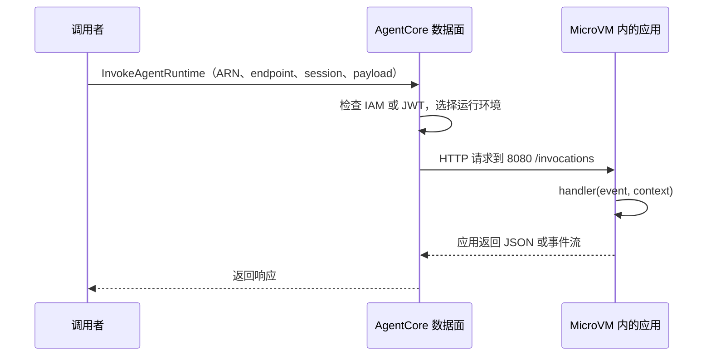

# 3.2 怎样调用 Agent

很多人到这一步会问：既然程序在 8080 端口运行，我直接请求云上的 8080 不就行了吗？

不是。**容器内的入口和云端对外接口，是两层接口。**

## 一、服务契约是什么

可以把“契约”理解为接口约定。AgentCore 知道往哪个端口、哪个路径发请求，你的程序就必须在那个位置接收，并按规定返回。

Runtime 的服务契约区分四种协议：[官方服务契约](https://docs.amazonaws.cn/en_us/bedrock-agentcore/latest/devguide/runtime-service-contract.html)。

| 协议 | 容器端口与入口 | 适合什么 |
| --- | --- | --- |
| HTTP | 8080，/invocations；可有 /ws | 普通请求/回答，JSON 或流式输出 |
| MCP | 8000，/mcp | 运行提供工具的 MCP Server |
| A2A | 9000，根路径；Agent Card 发现 | 按 A2A 标准与 Agent 交互 |
| AG-UI | 8080，/invocations 或 /ws | 面向界面的事件流交互 |

本教程选择 **HTTP**。多个 Agent 用 HTTP 相互调用也可以，数量变多不意味着必须换成 A2A；要支持现成 MCP 客户端时，才考虑把 Runtime 应用部署成 MCP Server。

## 二、本地直接调用容器入口

在本地，程序在你的电脑上运行，所以这样测试：

```text
POST http://127.0.0.1:8080/invocations
Content-Type: application/json

{"prompt":"hello"}
```

SDK 应用收到请求后调用入口函数。`prompt` 是我们自己定义的字段，Runtime 不要求所有应用都叫这个名字。

## 三、云端先调用 AWS 接口

部署后，调用者先访问 AgentCore 数据面。服务鉴权、选择 endpoint/版本、定位 session，再把请求送进运行环境。



你不是 SSH 到某台 AgentCore 机器，也不是把 MicroVM 的 8080 暴露给浏览器。应用本地路径的约定，不是对外公开地址。

## 四、IAM 调用：botocore 自动签名

```python
import json
import uuid
import botocore.session
from botocore.config import Config

session = botocore.session.get_session()
client = session.create_client(
    "bedrock-agentcore",
    region_name="cn-northwest-1",
    config=Config(connect_timeout=5, read_timeout=90, retries={"total_max_attempts": 1}),
)
response = client.invoke_agent_runtime(
    agentRuntimeArn=runtime_arn,
    qualifier="DEFAULT",
    runtimeSessionId=str(uuid.uuid4()),
    payload=json.dumps({"prompt": "hello"}).encode("utf-8"),
)
text = response["response"].read().decode("utf-8")
print(text)
```

这是底层 SDK 调用，不是把 API Key 塞进请求头。botocore 从你当前 AWS 身份取凭证，完成 SigV4 签名。

调用者需要 `bedrock-agentcore:InvokeAgentRuntime`，策略覆盖目标 Runtime 及被调用的 endpoint；SCP、权限边界或资源策略也可能限制调用。执行角色控制程序对外能做什么，调用者策略控制谁能进来，两者分开。

例如为你自己的调用角色配置下面的权限文档。`runtime_arn` 使用创建返回值；这份策略交给调用者的身份管理员配置，不加到 Runtime 自己的执行角色上：

```python
caller_policy = {
    "Version": "2012-10-17",
    "Statement": [{
        "Effect": "Allow", "Action": "bedrock-agentcore:InvokeAgentRuntime",
        "Resource": [runtime_arn, runtime_arn + "/runtime-endpoint/DEFAULT"],
    }],
}
```

只列出本例 DEFAULT endpoint，避免授予调用所有应用的权限。[资源与动作参考](https://docs.aws.amazon.com/service-authorization/latest/reference/list_bedrock-agentcore.html)

本例 `read_timeout=90` 是客户端读取等待期限，不是模型任务总期限，也不是 Runtime 固定上限。[Invoke API](https://docs.aws.amazon.com/botocore/latest/reference/services/bedrock-agentcore/client/invoke_agent_runtime.html)

## 五、四个参数分别是什么

| 参数 | 理解方式 | 本例 |
| --- | --- | --- |
| agentRuntimeArn | 找到要调用哪个应用 | 创建服务时返回的完整 ARN |
| qualifier | 选择应用的 endpoint | DEFAULT |
| runtimeSessionId | 标识一次运行会话 | UUID 字符串 |
| payload | 给程序的业务输入 | JSON 编码后的字节 |

**endpoint 与版本不同。** Runtime 更新会产生新版本，endpoint 是指向版本的调用入口。DEFAULT 是默认 endpoint，更新后自动指向新版本；自定义 endpoint 可以指向指定版本。实际调用前仍可核对入口状态与版本。[Runtime 工作方式](https://docs.amazonaws.cn/en_us/bedrock-agentcore/latest/devguide/runtime-how-it-works.html)

**session 不是聊天记录数据库。** 相同 session ID 可让后续请求复用运行环境，直到会话结束或回收；它不保证程序永久保存聊天。要长期保存历史，需要应用自己存储。

session ID 至少 33 个字符，普通 UUID 字符串有 36 个字符。给不同用户、不同任务分配不同会话；验证刚更新的应用时用新 session，避免旧会话继续使用原环境。

## 六、JWT 调用有什么不同

若 Runtime 配置了 JWT authorizer，调用者先向信任的企业 IdP 获取符合条件的 token，再携带 `Authorization: Bearer ...` 请求 Runtime。

服务校验签名、有效期及你配置的 audience/client/scope/claims。企业 IdP 负责登录与签发令牌，Runtime 负责校验调用凭证。

中国区不要直接复制 Cognito user pool 快速创建示例。IAM 与 JWT 是不同入站配置，不是给同一请求同时放两种凭证即可。[Runtime 入站说明](https://docs.amazonaws.cn/en_us/bedrock-agentcore/latest/devguide/runtime-oauth.html)

JWT 的请求仍进入 AgentCore 对外接口，然后才转到容器内部入口。HTTP 地址结构示意为：

```text
https://bedrock-agentcore.<区域>.amazonaws.com.cn/runtimes/<URL编码后的RuntimeARN>/invocations?qualifier=DEFAULT
```

使用时按服务文档/SDK 的当前端点构造，编码 ARN，设置本次会话头 `X-Amzn-Bedrock-AgentCore-Runtime-Session-Id`。IAM 入站请求不能只用普通 curl 不签名；本教程优先使用 botocore 避免自己拼签名。

## 七、JSON、流式输出、WebSocket

短请求可以一次返回 JSON。长回答可返回 SSE 事件流，让客户端逐段接收。WebSocket 用于双向实时交互，遵循单独握手与认证规则；不能把 `/ws` 当成一次普通 POST。

本页的 `.read()` 用于读取整个简单响应。若应用返回 SSE，应按事件解析；想边接收边显示，可读取响应流的 chunk，但网络 chunk 不一定等于完整事件，不可直接逐 chunk 当 JSON。

界面需要标准的开始、工具调用、文本片段和结束事件时，再考虑 AG-UI。入门先把一个 HTTP 请求/回答跑通。

## 八、练习：同一个应用，两个 session

连续调用两次 hello，第一次保留 session ID，第二次复用。再使用新 session 比较。响应耗时可能不同，但不要仅凭一次快慢断言平台性能；模型、工具、网络和运行环境准备都会影响。

本教程的调用命令默认生成新 session，也支持 `--session-id` 显式复用。业务隔离与历史保存仍要自己设计。

## 代码与下一步

[完整 botocore 调用](../examples/runtime/deploy.py)、[应用入口](../examples/runtime/app.py)。

下一节：[构建 Gateway](gateway.md)。
