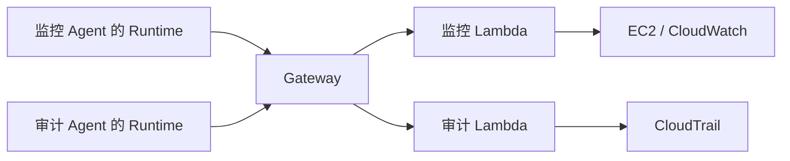
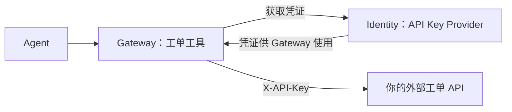

# 第四章：Agent 应用例子

基础设施已经有了。现在做一个小应用：查询服务器运行情况，再查询今天是否有人发起关机。

我们只用两个 Agent：**监控 Agent** 和 **审计 Agent**。这两种分工来自常见 CloudOps 场景，例子本身独立运行，不需要复制完整项目。

## 一、先明确各自的工作

监控 Agent 负责发现实例、查看 CPU 等指标。审计 Agent 负责查 CloudTrail 管理事件。它们各有入口、工具清单和权限。



Runtime 运行 Agent 代码。Gateway 连接工具。Lambda 查询数据。模型可以帮助 Agent 选择任务、组织结果；查询数据仍由工具完成。本章代码先实现模型选择任务，回答整理放在第五章讨论。

## 二、把工具写小

不要做一个“任意执行 AWS 命令”的万能工具。先给监控 Agent 两种操作，审计 Agent 一种操作：

| 操作 | 输入 | 输出 |
| --- | --- | --- |
| discover | 区域 | 运行中的实例 ID |
| metrics | 实例 ID、开始/结束时间 | 按实例分组的 CPU 数据 |
| audit | 开始/结束时间 | StopInstances 请求记录与涉及实例 |

没有实例 ID，就先发现实例。查性能时不能用账户聚合值猜具体实例；审计结果也不能仅凭 CPU 下降判断是否关机。

参考查询核心如下：

```python
pages = ec2.get_paginator("describe_instances").paginate(
    Filters=[{"Name": "instance-state-name", "Values": ["running"]}]
)
for page in pages:
    for reservation in page["Reservations"]:
        for instance in reservation["Instances"]:
            instance_ids.append(instance["InstanceId"])
```

发现实例后再查询 `AWS/EC2` 的 `CPUUtilization`，维度是 `InstanceId`。操作系统内存不在基础 EC2 指标里，需要另行采集，不能假造。

## 三、按用途拆角色

| 角色 | 允许操作 |
| --- | --- |
| 监控 Lambda 角色 | ec2:DescribeInstances、cloudwatch:GetMetricStatistics、自己的日志 |
| 审计 Lambda 角色 | cloudtrail:LookupEvents、自己的日志 |
| 两个 Runtime 角色 | 拉镜像、写日志、InvokeGateway；模型需要的独立权限 |
| Gateway 角色 | 调用本例的两个 Lambda |

部分只读 API 不支持资源级 ARN 约束，可能需要 `Resource: "*"`；仍需限定 Action、区域、输入和输出，不授予修改实例的权限。

工具前缀筛选有助于路由，但不是完整 IAM 隔离。共享 Gateway 需要在工具端或应用授权层继续验证访问身份；多租户或敏感场景可以拆 Gateway 与角色，不能只靠“模型不要调用别的工具”。

## 四、沿用第三章的构建方法

创建两个 Lambda，入口都可使用参考 `tools.py`；分别设置 `TOOL_KIND=monitoring` 和 `TOOL_KIND=audit`。代码会拒绝不属于该类型的操作。

把各自参数写入 schema，注册两个 target，命名 `monitoring` 和 `audit`。业务工具名均为 `cloud_query`，实际调用名取 tools/list 返回，通常是：

```text
monitoring___cloud_query
audit___cloud_query
```

创建过程和第三章一致：打包函数、创建角色、等待函数可用、授权 Gateway、注册 target、等待 READY、实际调用。

然后用参考 `agent_app.py` 构建 Agent 镜像，按第三章创建两个不同名称的 Runtime。每个 Runtime 指定三个环境变量：

| 变量 | 监控 Agent | 审计 Agent |
| --- | --- | --- |
| EXPERT_KIND | monitoring | audit |
| GATEWAY_URL | 服务返回的 Gateway URL | 同一个学习 Gateway URL |
| TOOL_REGION | cn-northwest-1 | cn-northwest-1 |

第三章脚本只创建固定名称的入门 Runtime。这里使用本章的分步辅助脚本：

```powershell
python examples/agents/build.py lambda
python examples/agents/build.py roles
```

第一步部署两种 Lambda、挂载 target。第二步创建两种 Runtime 角色和镜像仓库，把待部署信息保存在 `.local/agents.json`。之后构建镜像：

```powershell
$agents = Get-Content .local/agents.json -Raw | ConvertFrom-Json
$registry = $agents.repository_uri.Split('/')[0]
aws ecr get-login-password --region $agents.region | docker login --username AWS --password-stdin $registry
docker buildx build --platform linux/arm64 --provenance=false --load -t tutorial-agents:v1 examples/agents
docker tag tutorial-agents:v1 "$($agents.repository_uri):v1"
docker push "$($agents.repository_uri):v1"
python examples/agents/build.py runtimes
```

两个 Runtime 复用同一镜像，但环境变量和角色独立，分别执行自己的任务。

## 五、先用结构化请求验证工具链

向监控 Agent 发：

```json
{"task":"discover"}
```

从终端发出这两个真实调用：

```powershell
python examples/agents/invoke.py --expert monitoring --task discover
python examples/agents/invoke.py --expert audit --task audit
```

查询指标需要真实发现的 ID。将下面占位文字替换为发现结果中的一台实例 ID：

```powershell
python examples/agents/invoke.py --expert monitoring --task metrics --instance-id "替换为真实实例ID"
```

辅助脚本计算北京时间今天的时间窗。代码验证输入后调用相应 Gateway 工具，不调用模型。调用者必须有对应 Runtime 的调用权限，执行角色不能替调用者授予入站权限。

这一步只是链路测试。不是声称一个 if/else 程序已经具有自然语言理解能力。

## 六、加入模型，才处理自然语言

对于“查今天的关机记录”这类问题，Agent 可让模型生成受限的任务 JSON，再校验并调用工具。监控 Agent 只允许 discover/metrics，审计 Agent 只允许 audit。

参考应用支持可选 `MODEL_SECRET_ARN`：在你自己的 Secrets Manager 中保存模型接口配置，给 Runtime 角色仅授予该 Secret 的 GetSecretValue。配置包含 `url`、`key`、`model`，只用于支持相应 Chat Completions 接口的服务。

准备好可访问的模型接口后，执行下面可选步骤：

```powershell
python examples/agents/configure_model.py
```

程序分别询问完整 HTTPS 接口地址、模型名与 Key，创建本实验专用 Secret `tutorial-agent-model`。Key 不回显，也不保存在仓库文件中。然后它给两个 Runtime 角色追加限定 Secret 的权限，并在保留原环境变量的前提下更新 Runtime。已有同名 Secret 时先核对，不覆盖。

模型有自己的身份、网络和计费。未设置这项配置时，程序只接受结构化请求，并明确提示自然语言模式尚未配置；不会偷偷使用某个 Global 模型。

```json
{"question":"查询今天发起的关机操作"}
```

对应调用命令：

```powershell
python examples/agents/invoke.py --expert audit --question "查询今天发起的关机操作"
```

模型返回必须通过任务和参数校验；不要直接把模型生成的任意字符串当作云命令运行。模型最终整理回答时，也应保留工具证据和未解决项。

## 七、Identity 在哪里加入

上面的 AWS 查询使用 IAM，不必添加 API Key。现在增加一个外部工单 API，才会用到 Identity。



Gateway 负责“怎么调用工单工具”，Identity 负责“访问工单系统要用什么凭证”。外部系统真正允许查询哪些工单，仍由那个系统的 Key 权限决定。

完整操作在 [Identity：接入外部工单服务](identity.md)。这部分需要你拥有的可访问 API，不把某个真实企业接口写入公开教程。

## 八、验证时别忽略边界

“今天”在本例按北京时间计算，再转换 UTC 查询。CloudTrail 中失败的 StopInstances 请求不代表关机成功；成功的 API 请求也不能独自证明系统已经完全关闭。空指标不等于 CPU 为零。

当前运行中实例不代表今天运行过的所有实例。审计查询应独立检查今天的事件，再关联资源。

最后参考：[Agent 应用](../examples/agents/agent_app.py)、[业务工具](../examples/agents/tools.py)、[构建步骤](../examples/agents/build.py)、[调用脚本](../examples/agents/invoke.py)、[模型配置](../examples/agents/configure_model.py)、[AWS 多 Agent 示例](https://github.com/aws-samples/sample-cloudops-multi-agent-system)。

下一章：[Harness 实践](../05-harness/README.md)。
