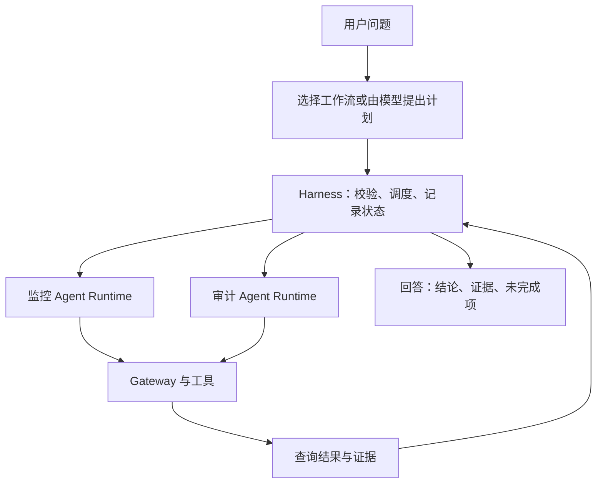
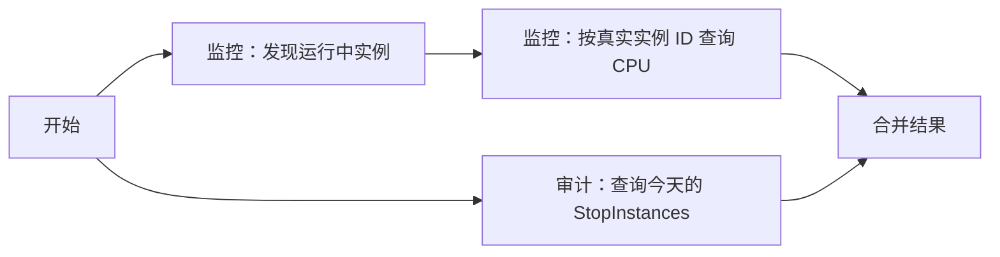

# 第五章：Harness 实践

假设用户问：“查一下今天服务器的 CPU，再看看有没有关机操作。”

第四章已经有能独立使用模型和 Gateway tools 的监控 Agent、审计 Agent。现在再处理另一个问题：一个任务需要同时协调多个 Agent 时，谁先做什么？某一步失败后，剩下的任务怎么办？多久还没结果，就应告诉用户失败了？

**Harness 就是围绕 Agent 的执行程序，负责把这些规则落实。** Agent 负责自己的模型与工具循环；Harness 在更外层检查和调度跨 Agent 的任务，工具提供证据。它也可以把进度和失败交给界面显示。

## 一、与 AgentCore 是什么关系

AgentCore Runtime 解决程序在哪里运行。Gateway 解决工具怎样接入。Identity 解决外部凭证如何使用。Harness 解决一项任务怎样可靠地执行完。



Harness 可以运行在你的本机、EC2 或一个单独的 Runtime。它调用专家时，仍使用第三章的 InvokeAgentRuntime 接口。

这里讲的是自己应用中的执行机制。中国区目前没有 Global 的托管 AgentCore Harness 服务，不能把两个名字当成同一项可用服务。[中国区功能说明](https://docs.amazonaws.cn/en_us/aws/latest/userguide/bedrock-agentcore.html)

## 二、先画出任务依赖

本例只有三个步骤。发现实例和查询关机事件可以同时开始；查询 CPU 必须等待实例 ID。



注意，监控 Agent 执行了两个步骤。同一个专家可以被多次调用，取决于任务依赖，而不是固定每人一次。

计划可以写成数据：

```json
[
  {"id":"discover","expert":"monitoring","task":"discover"},
  {"id":"audit","expert":"audit","task":"audit"},
  {"id":"metrics","expert":"monitoring","task":"metrics",
   "depends_on":["discover"],"instances_from":"discover"}
]
```

本例使用固定计划，便于看清执行过程。以后让模型产生计划时，也应先检查专家、任务、依赖与参数，然后交给同一个执行器。模型不能绕过执行器直接运行任意云命令。

## 三、为每一步定义状态

| 状态 | 含义 | 用户看到什么 |
| --- | --- | --- |
| succeeded | 工具已返回结果 | 展示结果和查询时间窗 |
| failed | 调用失败 | 标出未完成的查询，保留其他结果 |
| skipped | 上游失败或没有可查询实例 | 说明为何没有执行 |
| timed_out | 整项任务超过截止时间 | 结束等待，明确哪些步骤没有结果 |

“没有找到事件”与“事件查询失败”必须分开。后者不能被模型改写成“今天没有关机”。

本例限制最多 8 个计划步骤、并行 2 个调用，总等待上限 120 秒。单次 Runtime 请求设置 30 秒读取超时和一次尝试。读取超时是客户端等待某次网络读取的限制，不是服务端整个任务的硬截止时间。

Harness 到达截止时间后停止等待并标记超时；已经发出的云端请求可能仍在运行。Python 的线程取消也不能强制结束正在执行的网络调用。需要真正中断任务时，应用还要实现可检查的取消状态，并给工具、模型分别设置预算。

## 四、先在本地观察三种结果

从仓库根目录执行，无需云账号或模型：

```bash
python examples/harness/run.py
python examples/harness/run.py --fail audit
python examples/harness/run.py --fail discover
```

第一条使用模拟数据，三个步骤成功。第二条模拟审计失败，CPU 查询仍会完成。第三条模拟实例发现失败，CPU 查询被跳过，审计照常完成。

模拟实例 ID 和 CPU 值只用来演示状态，不能作为真实资源数据。程序会明确输出 `offline-fixtures`。

## 五、换成真实 Runtime

完成第四章两个 Runtime 的部署后：

```bash
python examples/harness/run.py --live
```

程序读取本地 `.local/agents.json` 中的两个 Runtime ARN，调用发现实例和审计，再把发现到的真实 ID 传给监控 Agent 查询 CPU。调用者必须具有这两个 Runtime 的 InvokeAgentRuntime 权限。

北京时间的今天会转换为 UTC 时间窗。详细报告写入 `.local/harness-report.json`，终端只展示步骤状态。报告可能含资源信息，保留在本地。

本例最多查询 20 台实例。发现结果被截断或超出这个范围，就明确失败；不会悄悄漏掉剩下的机器。没有运行中实例时跳过 CPU 查询。

## 六、怎样形成最后的回答

先由程序确定事实，再让模型整理语言。比如：

> CPU 查询已完成。审计查询失败，因此还不能判断今天是否发生过关机操作。

回答应包括区域、时间窗、涉及资源、查询结果和未完成项。云端结果中的 `truncated`、空指标、API 失败记录也应原样保留含义。

这个参考执行器返回报告，没有添加另一轮模型总结。接入模型时，把报告作为输入，并要求只根据成功步骤的证据回答；最终仍要检查是否遗漏失败项。

## 七、下一步怎么扩展

增加新场景，先增加专家的能力描述与工具 schema，再增加可验证的计划。不要每遇到一个问题，就把整个流程塞进提示词。

实际应用可以继续加入进度事件、有限重试、短期查询缓存、请求 ID 与追踪。修改资源前的审批也放在执行器中。只有明确失败可重试、剩余预算足够，才重试；修改操作还需要避免重复执行。

最后参考：[完整执行器](../examples/harness/run.py)、[第四章的两个 Agent](../04-agents/README.md)、[第三章的调用契约](../03-build/invoke.md)。
