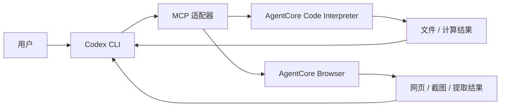
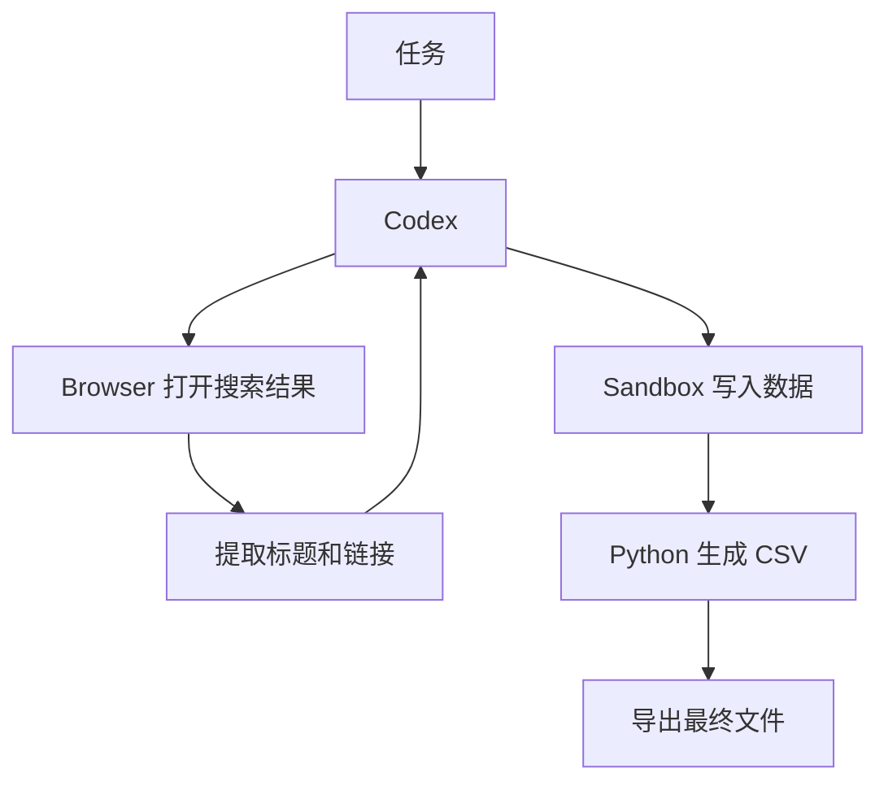

# 第六章：Code Interpreter + Browser - Codex 实践

这一章只做一件事：**让 Codex CLI 把 AgentCore Code Interpreter 和 Browser 当成可持续使用的工具。**

适合这样的任务：

- Codex 负责理解需求、写代码和决定下一步。
- Code Interpreter 负责在隔离环境里执行 Python、JavaScript 或 Shell。
- Browser 负责打开网页、点击、输入、提取页面内容和截图。

这三个组件分工不同，不要把它们混成一个运行环境。



## 一、为什么要这样组合

Codex CLI 本身适合做长期编码任务，但有两类工作单独放在本机并不理想：

1. 临时执行依赖不确定的代码，例如安装 Python 包、跑一次数据分析。
2. 访问网页并完成浏览器交互，例如搜索资料、翻页、抓取页面内容。

Code Interpreter 和 Browser 正好分别解决这两件事。

Codex 不需要“搬进” Code Interpreter 或 Browser。更简单的方式是：**让 Codex 通过 MCP 调用一个本地适配器，由适配器再调用 AgentCore 服务。**

## 二、准备条件

先准备：

- 已安装 Codex CLI。
- 已配置 AWS 中国区凭证。
- 已有一个 AgentCore Code Interpreter。
- 已有一个 AgentCore Browser。
- Python 3.11+。
- MCP Python SDK 和 boto3。

示例默认区域：

```text
cn-northwest-1
```

资源 ID 不写死在代码里，建议放在本地配置文件或环境变量，例如：

```json
{
  "region": "cn-northwest-1",
  "code_interpreter_id": "your-code-interpreter-id",
  "browser_id": "your-browser-id"
}
```

这些配置只保留在本机，不提交到 Git 仓库。

## 三、先做一个持续 Code Interpreter 会话

Code Interpreter 最重要的是**复用同一个 session**。这样安装的包、Python 变量和临时文件可以在连续调用之间保留。

最小逻辑：

```python
import boto3

region = "cn-northwest-1"
client = boto3.client("bedrock-agentcore", region_name=region)

code_interpreter_id = "your-code-interpreter-id"
session_id = None

def ensure_session():
    global session_id
    if session_id:
        return session_id

    response = client.start_code_interpreter_session(
        codeInterpreterIdentifier=code_interpreter_id,
        name="codex-workspace",
        sessionTimeoutSeconds=28800,
    )
    session_id = response["sessionId"]
    return session_id
```

执行 Python：

```python
def run_python(code: str):
    sid = ensure_session()
    response = client.invoke_code_interpreter(
        codeInterpreterIdentifier=code_interpreter_id,
        sessionId=sid,
        name="executeCode",
        arguments={
            "code": code,
            "language": "python",
            "clearContext": False,
        },
    )

    output = []
    for event in response["stream"]:
        result = event.get("result")
        if not result:
            continue
        for item in result.get("content", []):
            if item.get("type") == "text":
                output.append(item.get("text", ""))

    return "\n".join(output)
```

连续两次调用：

```python
print(run_python("number = 41\nprint(number)"))
print(run_python("print(number + 1)"))
```

第二次还能读取第一次创建的变量，说明 session 在复用。

Shell 也可以用同一个 session：

```python
def run_shell(command: str):
    sid = ensure_session()
    response = client.invoke_code_interpreter(
        codeInterpreterIdentifier=code_interpreter_id,
        sessionId=sid,
        name="executeCommand",
        arguments={"command": command},
    )

    output = []
    for event in response["stream"]:
        result = event.get("result")
        if not result:
            continue
        for item in result.get("content", []):
            if item.get("type") == "text":
                output.append(item.get("text", ""))

    return "\n".join(output)
```

例如：

```text
pip install pandas
```

然后再执行 Python 使用 pandas。

## 四、把 Code Interpreter 包成 Codex MCP 工具

Codex CLI 可以注册 stdio MCP server。最小适配器结构：

```python
from mcp.server.fastmcp import FastMCP

server = FastMCP("agentcore-sandbox")

@server.tool()
def sandbox_run(code: str, language: str = "python") -> str:
    """在持续 AgentCore Code Interpreter session 中执行代码。"""
    if language == "python":
        return run_python(code)
    raise ValueError("示例只实现 Python")

@server.tool()
def sandbox_command(command: str) -> str:
    """在持续 session 中执行 Shell 命令。"""
    return run_shell(command)

server.run(transport="stdio")
```

然后把这个 MCP server 注册给 Codex CLI。

具体注册命令会随 Codex CLI 版本变化，先查看：

```bash
codex mcp --help
```

目标是让 Codex 看到类似两个工具：

```text
sandbox_run
sandbox_command
```

之后就可以直接告诉 Codex：

```text
用 agentcore-sandbox 执行 Python，生成 1000 个随机数并计算均值和 P95。
```

Codex 决定何时调用工具，Code Interpreter 负责执行。

## 五、文件怎么处理

Code Interpreter 内的文件属于临时 session。推荐把工作分成两类：

```text
临时文件
  └─ 留在 Code Interpreter session

最终产物
  └─ 显式导出到持久存储
```

例如：

```python
run_python("""
from pathlib import Path
Path("outputs").mkdir(exist_ok=True)
Path("outputs/result.txt").write_text("done", encoding="utf-8")
print("outputs/result.txt")
""")
```

然后由你的适配器读取文件，再写到 S3。

不要把二进制文件内容直接塞进模型上下文。模型只需要知道：

- 文件名
- 大小
- S3 URI 或下载 ID

## 六、再接 Browser

Browser 与 Code Interpreter 相同，也建议保持一个持续 session。

基本流程：

```text
Codex
  ↓
browser_start
  ↓
browser_navigate
  ↓
browser_snapshot
  ↓
browser_click / browser_fill / browser_press
  ↓
browser_extract / browser_screenshot
```

一个实用的 MCP 工具集合：

```text
browser_start
browser_navigate
browser_snapshot
browser_click
browser_fill
browser_press
browser_extract
browser_screenshot
browser_stop
```

Codex 不需要知道 Playwright 或 Browser SDK 的内部实现，只需要这些清晰的工具契约。

例如：

```text
使用 agentcore-browser 打开 AWS 中国区 AgentCore 页面，
读取页面主要内容并保存截图。
```

Codex 可以按下面的顺序执行：

```text
1. browser_start
2. browser_navigate(url)
3. browser_snapshot()
4. 根据 snapshot 判断是否需要点击
5. browser_extract()
6. browser_screenshot()
```

## 七、人工接管 Browser

Agent 浏览网页时，有些情况更适合人来完成：

- 登录
- 验证码
- 页面布局复杂
- 需要人工确认

因此 Browser 最好增加两种控制状态：

```text
agent mode
human mode
```

进入 human mode 后，MCP 浏览器动作应该暂停，避免 Codex 和用户同时操作页面。

伪代码：

```python
if browser_mode == "human":
    raise RuntimeError("Browser is currently controlled by the user")
```

用户完成操作后再切回 agent mode，Codex 继续。

这比让 Codex 不断重试登录页更可靠。

## 八、给 Codex 一段工作区规则

Codex 最好知道这些边界。可以在工作目录放一个 `AGENTS.md`：

```markdown
# AgentCore tools

需要临时执行代码、安装包或分析数据时，使用 agentcore-sandbox。

Sandbox 是持续会话。工具调用完成后不要主动停止，除非用户明确要求。

需要浏览网页时使用 agentcore-browser。

用户人工接管 Browser 后停止浏览器动作，等待用户交还控制。

最终文件需要显式导出到持久存储。不要把二进制内容直接输出到模型上下文。
```

这样 Codex 在长期任务中会更稳定地使用这些工具。

## 九、完整实践流程

一个典型任务：

```text
帮我找三篇 AgentCore 相关资料，提取标题和链接，
然后用 Python 生成 CSV。
```

实际执行可以是：



关键不是让 Browser 和 Code Interpreter 互相调用，而是 **Codex 作为上层协调者分别调用两类工具**。

## 十、实践时最重要的几条

1. Sandbox 和 Browser 都尽量复用持续 session。
2. 不要每次工具调用后自动 stop。
3. Code Interpreter 负责执行，不负责长期文件存储。
4. Browser 负责网页操作，不负责业务逻辑。
5. Codex 决定什么时候调用哪个工具。
6. MCP adapter 只做协议转换、session 管理和必要的安全限制。
7. 最终产物显式导出，避免把大文件经过模型上下文。

这就是 Codex CLI + AgentCore Code Interpreter + Browser 最小而实用的组合。
