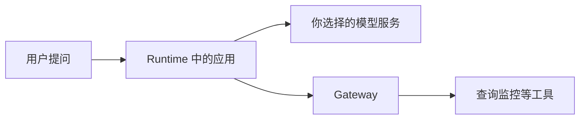

# 从零认识 AgentCore

本教程以一个简单的运维 Agent 为例，介绍 AgentCore Runtime、Gateway、Identity、Harness、Code Interpreter、Browser 和 Observability 的基本用法。默认使用 AWS 中国（宁夏）区域，也适用于北京区域。

## 一、核心组件

| 组件 | 用途 | 说明 |
| --- | --- | --- |
| **Runtime** | 托管 Agent 应用 | 部署应用，接收请求并运行 |
| **Gateway** | 提供统一工具入口 | 将 Lambda、API 等注册为 Agent 可调用的工具 |
| Identity | 管理身份与外部凭证 | 管理 Agent 工作负载身份，以及访问外部系统的 token、API Key |
| Observability | 提供运行观测 | 查看日志、指标和 Trace |
| Browser | 提供托管浏览器 | 为网页操作任务提供浏览器会话 |
| Code Interpreter | 提供隔离执行环境 | 执行代码并进行数据计算与分析 |

教程先从 Runtime 和 Gateway 开始，再逐步加入其他组件。[中国区官方介绍](https://www.amazonaws.cn/agentcore/)

## 二、AgentCore 的模型配置方法

AgentCore Runtime 运行的是你的 Agent 应用，模型由应用自己配置。下面以 DeepSeek 为例：

~~~python
from strands import Agent
from strands.models.openai import OpenAIModel

model = OpenAIModel(
    client_args={
        "api_key": deepseek_api_key,
        "base_url": "https://api.deepseek.com",
    },
    model_id="deepseek-v4-pro",
)

agent = Agent(model=model)
~~~

DeepSeek 提供 OpenAI-compatible API。API Key 应存放在 Secrets Manager 或其他安全配置中。

参考：[AgentCore 使用任意模型](https://docs.amazonaws.cn/bedrock-agentcore/latest/devguide/using-any-model.html)。

## 三、费用

下面是 2026 年 10 月 5 日核对的 AWS 中国区公开标价：

| 项目 | 公开标价 |
| --- | --- |
| Runtime CPU | ¥0.866904192 / vCPU 小时 |
| Runtime 内存 | ¥0.114817248 / GB 小时 |
| Browser / Code Interpreter CPU | ¥0.60805584 / vCPU 小时 |
| Browser / Code Interpreter 内存 | ¥0.064202544 / GB 小时 |
| Gateway 操作 | ¥0.0339696 / 千次 |
| 单独使用 Identity 获取外部凭证 | ¥0.0679392 / 千次成功 token 或 API Key 请求 |
| Observability | 按 CloudWatch 相关用量收费 |

Runtime 按实际资源使用量计费。

通过 Runtime 或 Gateway 使用 Identity，不另收上述 Identity 凭证请求费。[中国区价格及计费规则](https://www.amazonaws.cn/agentcore/pricing/)

实际费用还可能包括模型调用、Lambda、ECR、CloudWatch 和网络等相关服务。

## 四、学习路径

1. **[AWS 中国区功能介绍](01-china/README.md)**：了解核心组件、中国区支持情况和对应实现方式。
2. **[Vibe coding MCP 使用](02-mcp/README.md)**：为编码工具接入 AgentCore MCP，查询文档并辅助开发。
3. **[服务构建指南](03-build/README.md)**：部署 Runtime、Gateway 和 MCP 工具链。
4. **[完整 Agent 实践](04-agents/README.md)**：使用 Strands + DeepSeek 构建可调用 Gateway tools 的 Agent。
5. **[Harness 实践](05-harness/README.md)**：实现多 Agent 任务编排、超时和失败处理。
6. **[Code Interpreter + Browser - Codex 实践](06-codex-tools/README.md)**：让 Codex CLI 通过 MCP 使用持续 Code Interpreter 和 Browser 会话。
7. **[Observability 实践](07-observability/README.md)**：用 AgentCore Observability 和 CloudWatch 查看指标、日志与 Trace。
8. **[Cleanup](08-cleanup/README.md)**：删除教程创建的 Runtime、Gateway、Lambda、ECR、IAM 和 Secrets Manager 资源。

