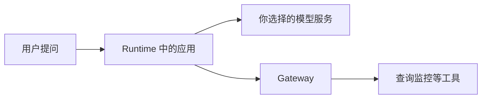

# 从零认识 AgentCore

假设你想做一个运维助手。

你问：“今天服务器运行得怎么样？”它查询监控，查看审计记录，然后给出一段解释。

在电脑上写一个这样的程序，并不难。但要让别人也能用，你还得解决几件事：程序放在哪里运行？如何连接工具？谁可以调用？访问外部系统的密钥放在哪里？出了问题，去哪里看日志？

**AgentCore 提供的，就是这些基础设施。** 你写助手的逻辑，它提供运行环境和连接能力。

这份教程面向第一次接触 AgentCore 的读者。默认使用 AWS 中国（宁夏）区域；北京区域的选择方法也会说明。你只需懂一点 Python，按顺序读下去。

## 一、六个组件，先记住两个

| 组件 | 可以把它想成 | 用途 |
| --- | --- | --- |
| **Runtime** | 程序的运行场所 | 把 Python 应用部署到云端，接收请求并运行 |
| **Gateway** | 工具的统一入口 | 把 Lambda、API 等提供成 Agent 可以调用的工具 |
| Identity | 外部凭证的管理处 | 管理 Agent 身份，以及访问外部系统的 token、API Key |
| Observability | 运行记录 | 通过日志、指标和追踪检查程序发生了什么 |
| Browser | 云上的浏览器 | 为必须操作网页的任务提供浏览器会话 |
| Code Interpreter | 隔离的计算环境 | 执行代码，对数据做计算和分析 |

开始时，先弄清 Runtime 和 Gateway 就够了。其余组件在有需求时加入，不必为了“完整”全部启用。[中国区官方介绍](https://www.amazonaws.cn/agentcore/)

## 二、AgentCore 的模型配置方法

AgentCore Runtime 运行的是你的 Agent 应用，模型由应用自己配置。下面以 DeepSeek 为例：

~~~python
from strands import Agent
from strands.models.openai import OpenAIModel

model = OpenAIModel(
    client_args={
        "api_key": deepseek_api_key,
        "base_url": "https://api.deepseek.com",
    },
    model_id="deepseek-chat",
)

agent = Agent(model=model)
~~~

DeepSeek 提供 OpenAI-compatible API，因此可以直接作为模型提供给 Agent。实际项目中 API Key 应放在 Secrets Manager 或其他安全配置中，不要写进代码。

参考：[AgentCore 使用任意模型](https://docs.amazonaws.cn/bedrock-agentcore/latest/devguide/using-any-model.html)。

## 三、费用要分开看

下面是 2026 年 10 月 5 日核对的中国区公开标价。Runtime 页面当前列的是 **v2** 价格；实际使用的版本、区域与账单以服务和官方价格页为准。

| 项目 | 公开标价 |
| --- | --- |
| Runtime v2 CPU | ¥0.866904192 / vCPU 小时 |
| Runtime v2 内存 | ¥0.114817248 / GB 小时 |
| Browser / Code Interpreter CPU | ¥0.60805584 / vCPU 小时 |
| Browser / Code Interpreter 内存 | ¥0.064202544 / GB 小时 |
| Gateway 操作 | ¥0.0339696 / 千次 |
| 单独使用 Identity 获取外部凭证 | ¥0.0679392 / 千次成功 token 或 API Key 请求 |
| Observability | 按 CloudWatch 相关用量收费 |

这些是计费单位，不是要求你提前购买一小时。Runtime 按实际资源消耗计费；等待模型时没有 CPU 消耗的部分不收 CPU 费，但内存等费用仍需考虑。

通过 Runtime 或 Gateway 使用 Identity，不另收上述 Identity 凭证请求费。这里的 token 指身份访问令牌，不是模型生成的文字 token。[中国区价格及计费规则](https://www.amazonaws.cn/agentcore/pricing/)

一项任务的总费用还可能包括模型调用、Lambda、ECR、日志和网络。不要把 Gateway 的千次价格当作整个助手的千次价格。

## 四、按这七章学习

1. **[AWS 中国区功能介绍](01-china/README.md)**：组件怎么分工，Global 有哪些不同，缺失能力如何处理。
2. **[Vibe coding MCP 使用](02-mcp/README.md)**：给编码助手接入 AgentCore MCP，让它帮你查文档和写代码。
3. **[服务构建指南](03-build/README.md)**：先把 Runtime、Gateway 和 MCP 工具链搭起来，理解 AgentCore 的基础设施。
4. **[完整 Agent 实践](04-agents/README.md)**：在第三章基础上加入 DeepSeek 和 Agent loop，让 Agent 自主调用 Gateway tools。
5. **[Harness 实践](05-harness/README.md)**：把多个步骤组织成能够完成、失败时也能结束的任务。
6. **[Code Interpreter + Browser - Codex 实践](06-codex-tools/README.md)**：让 Codex CLI 通过 MCP 使用持续 Code Interpreter 和 Browser 会话。
7. **[Observability 实践](07-observability/README.md)**：用 AgentCore Observability 和 CloudWatch 查看指标、日志与 Trace。

教程的运维例子借鉴 [AWS CloudOps 示例](https://github.com/aws-samples/sample-cloudops-multi-agent-system)，但不要求你部署完整 CloudOps 项目。这里使用独立的学习资源，不包含某个线上环境的 IP、账户信息或密码。

每章都有解释、例子与操作方法。完整代码放在章节末尾，供你读懂之后使用。
